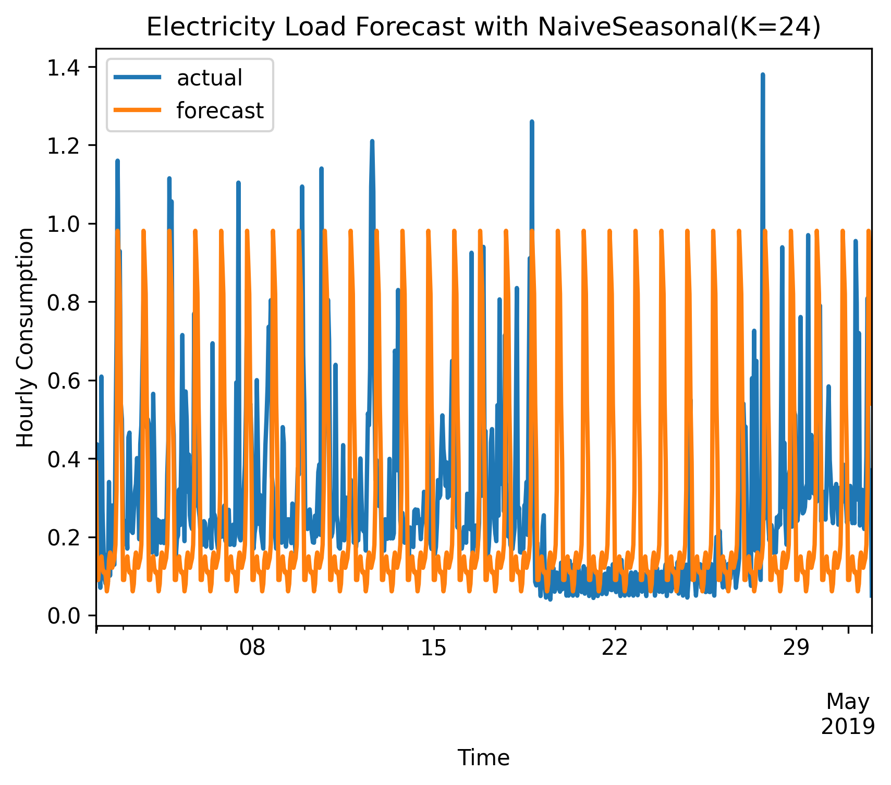
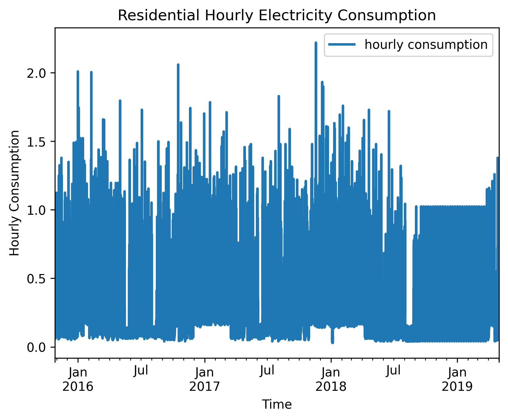

# Electricity Load Forecasting with Darts

## 项目简介

本项目基于 Unit8 的 Darts 时间序列预测库，对真实住户级电力负荷数据进行建模与预测。项目完成了数据下载、清洗、累计电表读数转换、时间序列可视化、训练/验证集划分、多模型对比、时间协变量建模和预测结果保存。

项目目标是预测某一住户未来 30 天的小时级用电量，并比较简单季节性基线模型、传统统计模型和机器学习模型在真实负荷数据上的表现。

## 数据集

数据来源为 Open Power System Data 的 Household Data 数据集：

- 文件：`household_data_60min_singleindex.csv`
- 频率：小时级
- 时间范围：2015-10-26 到 2019-05-01
- 预测对象：`DE_KN_residential5_grid_import`
- 原始含义：住户从电网购入的累计电量

由于原始列是累计电表读数，本项目通过一阶差分将其转换为每小时用电量：

```text
hourly_consumption = current_cumulative_import - previous_cumulative_import
```

处理后得到约 30,803 个小时级时间点，平均每小时用电量约为 0.285 kWh。

## 方法流程

项目主要流程如下：

```text
1. 读取 Open Power System Data 电力数据
2. 选择 residential5 的 grid_import 列
3. 删除目标列缺失值
4. 将累计电量转换为小时用电量
5. 构造 Darts TimeSeries
6. 使用最后 30 天作为验证集
7. 训练并比较多个预测模型
8. 保存模型评估结果和最佳预测图
```

验证集设置：

- 训练集：2015-10-26 12:00 到 2019-04-01 22:00
- 验证集：2019-04-01 23:00 到 2019-05-01 22:00
- 验证长度：720 小时，即最后 30 天

## 对比模型

本项目对比了以下模型：

- `NaiveSeasonal(K=24)`：使用昨天同一小时作为预测值
- `NaiveSeasonal(K=168)`：使用上周同一小时作为预测值
- `RandomForestModel`：基于历史滞后特征建模
- `RandomForestModel + time covariates`：加入 hour、dayofweek、month 时间协变量
- `ExponentialSmoothing(seasonal=24)`：带日周期的指数平滑模型

评价指标包括：

- MAE：平均绝对误差
- RMSE：均方根误差
- MAPE：平均百分比误差

## 实验结果

| Model | MAE | RMSE | MAPE |
|---|---:|---:|---:|
| NaiveSeasonal(K=24) | 0.2095 | 0.3027 | 104.68 |
| NaiveSeasonal(K=168) | 0.2101 | 0.2977 | 118.29 |
| RandomForestModel + time covariates | 0.2288 | 0.2677 | 167.94 |
| RandomForestModel | 0.2661 | 0.2992 | 196.85 |
| ExponentialSmoothing(seasonal=24) | 0.3061 | 0.3359 | 225.50 |

## 结果分析

按 MAE 衡量，`NaiveSeasonal(K=24)` 表现最好，说明住户级小时用电具有较强的日周期重复性。

按 RMSE 衡量，`RandomForestModel + time covariates` 表现最好，说明加入小时、星期和月份等时间特征有助于降低较大的预测误差。

MAPE 整体偏高，主要原因是住户小时用电量存在大量低值时段。当真实值接近 0 时，即使绝对误差较小，百分比误差也会被明显放大。因此在该任务中，MAE 和 RMSE 比 MAPE 更适合作为主要评价指标。

## 结果可视化

最佳模型预测效果如下：



小时用电量序列如下：



## 输出文件

- `outputs/electricity_model_comparison.csv`：真实电力负荷模型对比结果
- `outputs/electricity_best_forecast.png`：按 MAE 选择的最佳模型预测图
- `outputs/electricity_hourly_consumption.png`：小时用电量可视化
- `outputs/electricity_train_val_split.png`：训练集和验证集划分图

## 运行方式

进入项目根目录后运行：

```powershell
python src/real_main.py
```

程序会自动训练多个模型，并保存模型对比结果和最佳预测图。

## 项目收获

通过本项目，完成了一个较完整的时间序列预测流程：

- 使用真实电力数据构建小时级负荷预测任务
- 识别并处理累计电表读数，将其转换为小时用电量
- 使用 Darts 的 `TimeSeries`、`fit()` 和 `predict()` 接口完成统一建模
- 建立日周期和周周期基线模型，并与机器学习模型对比
- 使用时间协变量增强 RandomForestModel 的预测能力
- 结合 MAE、RMSE、MAPE 分析不同指标下的模型表现差异
